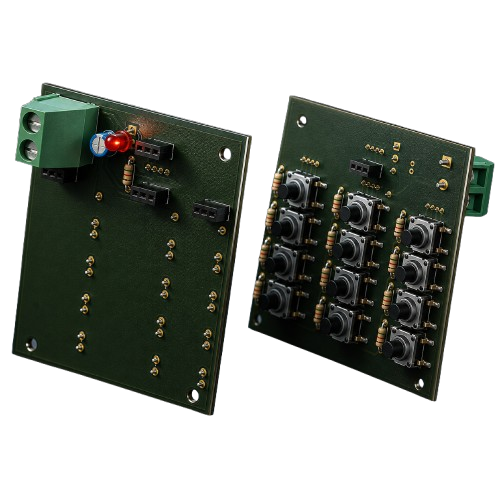

<div align="center">

# KATARA-VD

### A Vending Machine That Doesn't Sell — It Gives

*Free medications, a community-powered fund, and a humanoid robot that keeps it stocked — technology in service of humanity.*

<p align="center">
  
</p>

<p align="center">
  
  
  
</p>


Built by **HABBOUBY EDEM**

</div>

---

## Table of Contents

- [About](#about)
- [Repository Structure](#repository-structure)
- [Scope of This Submission](#scope-of-this-submission)
- [Note on Physical Fabrication](#note-on-physical-fabrication)
- [The Story Behind KATARA-VD](#the-story-behind-katara-vd)
- [The Ecosystem: 2 Systems, 1 Mission](#the-ecosystem-2-systems-1-mission)
- [Vending Machine](#vending-machine)
  - [Part 1 — Skeleton, Shelving & Archimedean Dispensers](#part-1--skeleton-shelving--archimedean-dispensers)
  - [Part 2 — Solar Power & Access Doors](#part-2--solar-power--access-doors)
  - [Part 3 — Prescription Verification System](#part-3--prescription-verification-system)
  - [Part 4 — Coin Dispensing Mechanism ("Giving Money")](#part-4--coin-dispensing-mechanism-giving-money)
  - [Part 5 — Coin Acceptance & Storage](#part-5--coin-acceptance--storage)
  - [Part 6 — Charity Keypad PCB](#part-6--charity-keypad-pcb)
  - [Part 7 — Thermal Sensing & Voice Interaction](#part-7--thermal-sensing--voice-interaction)
- [JALOUL — The Restocking Humanoid](#jaloul--the-restocking-humanoid)
  - [Part 8 — Head & Expression System](#part-8--head--expression-system)
  - [Part 9 — Body & Shoulder Joints](#part-9--body--shoulder-joints)
  - [Part 10 — Arm Completion & 360° Gripper](#part-10--arm-completion--360-gripper)
  - [Part 11 — Mecanum Base & Vertical Lift](#part-11--mecanum-base--vertical-lift)
  - [Part 12 — Frame Reinforcement & LiDAR](#part-12--frame-reinforcement--lidar)
- [The Humanitarian Logic — How the Community Fund Works](#the-humanitarian-logic--how-the-community-fund-works)
- [Electronics & PCB](#electronics--pcb)
- [Materials & Fabrication](#materials--fabrication)
- [Fasteners](#fasteners)
- [CAD Files](#cad-files)
- [Simulations](#simulations)
- [On AI Assistance](#on-ai-assistance)
- [Future Improvements](#future-improvements)
- [License](#license)

---

## About

**KATARA-VD** is a smart vending machine that gives instead of sells — dispensing free medication to people who need it, and running on a self-sustaining community fund where those who can afford to give €2 a day keep the machine stocked for those who can't. A humanoid restocking robot, **JALOUL**, keeps its shelves filled without any human ever needing to open it up.

Two systems, one mission:

1. **The Vending Machine** — 5 shelves of medication, ID-gated by an Intel RealSense prescription scan, a solar-backed power system, and a full charity logic built into its own PCB.
2. **JALOUL** — a 10-joint humanoid robot on a mecanum base, designed specifically to restock the machine's shelves autonomously.

Designed from scratch in SolidWorks and KiCad.

---

## Repository Structure

```text
KATARA-VD/
│
├── 01_3D/
│   ├── SOLIDWORKS_FILES/
│   │   ├── HUMANOID_ROBOT JALOUL/      # JALOUL — native SolidWorks parts & assemblies
│   │   └── VENDING_MACHINE/            # Vending machine — native SolidWorks parts & assemblies
│   ├── STEP_FILES/
│   │   ├── HUMANOID_ROBOT JALOUL/      # total assembly of jaloul.STEP
│   │   └── VENDING_MACHINE/            # assembly vending machine.STEP
│   └── STL/
│       ├── HUMANOID_ROBOT JALOUL/      # Slicer-ready STL, split by sub-assembly
│       └── VENDING_MACHINE/            # Slicer-ready STL, split by sub-assembly
│
├── 02_DXF/
│   └── VENDING_MACHINE/                # Flat panels (walls, base, shelves...) for CNC laser-cut MDF
│
├── 03_PCB_DESIGN/
│   ├── VENDING MACHINE PCB.kicad_sch / .kicad_pcb / .kicad_pro / .kicad_prl
│   └── CARTE ELEC MEC 07.step
│
├── 04_DOCS/
│   └── KATARA-VD_PCB_Components.xlsx   # Full BOM with Amazon sourcing links
│
├── 05_MEDIA/
│   ├── IMAGES/
│   │   ├── main image of the project.png
│   │   ├── VENDING MACHINE 4K.png
│   │   ├── JALOUL 4K.png
│   │   ├── JALOUL in different positions.png
│   │   └── PCB_KEYBOARD_4K.png
│   └── SIMULATIONS/
│       ├── mechanism of prescription.gif
│       ├── mechanism of giving money.gif
│       ├── GIF MEC PUSHING THE MONEY INTO THE BOX.gif
│       ├── mechanism for opening and closing door.gif
│       └── translation of the robot on yy' axis.gif
│
├── LICENSE
└── README.md
```

---

## Scope of This Submission

**Mechanical CAD + custom KiCad PCB** for the charity keypad module, plus the full mechanical design of the vending machine's dispensing/coin systems and of JALOUL. Firmware and the identification/database backend are not included yet — the control architecture (Raspberry Pi 5 for vision, Arduino Mega 2560 for actuator control) is documented as design intent throughout this README.

---

## Note on Physical Fabrication

I still don't have access to a 3D printer, an Intel RealSense camera, or a Raspberry Pi — import taxes make them very expensive in Tunisia, and local paid makerspaces are scarce. On top of that, several of this machine's parts (the main walls, the base, the shelving panels) are simply too large to be realistically FDM-printed even if I had a printer.

So KATARA-VD ships as a **complete, fabrication-ready package** using two complementary paths:

- **CNC laser-cut MDF** (`02_DXF/`) for the large flat structural parts — walls, base, shelves — sized and nested as real DXF files, ready to send to any laser-cutting service.
- **3D-printable STL/STEP** (`01_3D/`) for the smaller mechanical parts — dispensers, mechanisms, JALOUL's joints and gripper.

This mixed approach keeps the project realistic and buildable even without local printer access — MDF panels are cheap, available everywhere, and don't need a 3D printer at all.

---

## The Story Behind KATARA-VD

The idea didn't start with a blueprint — it started with a question.

Hack Club gave me, and a lot of other young makers, a shot at being among the elite — not by paying for it, but through pure cultural and technical exchange: build something real, and the door opens. That stuck with me. If a community can create opportunity just by giving people a chance to build and share, why couldn't I build something that gives back the same way, in my own field — robotics?

That question became KATARA-VD: a vending machine that doesn't sell anything. It gives.

The machine holds **5 shelves of medication**, but nobody can just walk up and take what they want. Access is gated by a prescription scan: a mechanism converts rotary motion into linear motion to extend a magnetic plate outward, two small arms hold the prescription against it, an **Intel RealSense** camera reads it, and only then does the system know exactly which medication to release — and to whom.

Running that kind of machine costs money, so I built the funding into the machine itself instead of relying on an external charity. Two keypads, each with its own OLED, handle two opposite flows: one lets a family in need request money (capped so they can feed themselves), the other lets someone whose finances are stable contribute to the fund. Every person is identified by their own code, so the machine always knows who's asking and who's giving — and can hold both sides accountable. The full logic is detailed in [The Humanitarian Logic](#the-humanitarian-logic--how-the-community-fund-works) below.

Because a project like this can't afford to go dark, a **solar panel** kicks in whenever the batteries run low. And because a machine like this will be approached by people in real distress, I added a thermal camera to read basic signs of distress on the person standing in front of it — anger, sadness, or symptoms serious enough to count as a medical emergency — paired with a small speaker so the machine can respond, not just dispense.

The last piece was keeping it stocked without needing a person to open it every day. That's where **JALOUL** comes in — a humanoid robot built specifically to restock KATARA-VD's shelves, which slide out to meet it through a scissor-lift mechanism designed to save space inside the machine.

---

## The Ecosystem: 2 Systems, 1 Mission

| # | Subsystem | Role |
|---|-----------|------|
| 1 | **Vending Machine** | Verifies prescriptions, runs the community fund, dispenses medication |
| 2 | **JALOUL** | Restocks the machine's shelves autonomously, no human intervention needed |

The vending machine's charity keypad and dispensing logic run on their own KiCad PCB. JALOUL is a separate, self-contained humanoid platform.

---

# Vending Machine

## Part 1 — Skeleton, Shelving & Archimedean Dispensers

<p align="center">
  
</p>

The main skeleton holds **5 shelves**, each guided by two systems working together: a **dual-rail linear guide** and a **wheel-based guide**, keeping every shelf level and stable as it moves. To save interior space while still letting JALOUL reach every level, the shelves extend outward through a **scissor-lift mechanism** driven by a **NEMA 17 stepper motor** — one per shelf, as shown above. Each shelf dispenses its products through a spiral **Archimedean screw**, turning rotary motion into steady, single-item feeding.

---

## Part 2 — Solar Power & Access Doors

<p align="center">
  
</p>

The machine carries its own **solar panel and mounting bracket** on top, feeding the battery system so it never runs dry. Two actuators (**vérins**) open the front doors — each guided by two hinges — so the shelves become accessible to JALOUL from the outside without exposing the machine's interior to the public. A dedicated electrical compartment houses the machine's power and control boards.

---

## Part 3 — Prescription Verification System

<p align="center">
  
</p>

Access to the medication is gated by a scan, not by a button press. A **stepper-driven rotary-to-linear mechanism**, guided by two rails and two wheels fitted with **radial ball bearings**, extends a plate out of the machine. The plate holds the prescription in place via a **magnetic mount** — two small arms clamp onto it using the same magnetic principle. Once retracted inside, an **Intel RealSense** camera — fixed at a precisely calculated angle to capture the whole document — scans the prescription to identify the medication and confirm the correct dispensing choice. The sequence: extend to receive the prescription → retract to scan → extend again to return it to the person.

<p align="center">
  
  
</p>

*Left: side-view cutaway of the rotary-to-linear stepper mechanism with the RealSense camera positioned above it. Right: top-down view of the prescription clamped between the two magnetic arms before the scan.*

---

## Part 4 — Coin Dispensing Mechanism ("Giving Money")

<p align="center">
  
</p>
<p align="center">
  
</p>

When a family withdraws money from the fund, an **MG90S metal-gear servo** drives a **rack-and-pinion system**, sized precisely to the dimensions of a 1-euro coin, pushing out two coins at a time. A second servo locks and unlocks a small security door that covers the coin slot; once unlocked, the door opens smoothly, guided at its edge by two matching pieces.

---

## Part 5 — Coin Acceptance & Storage

<p align="center">
  
</p>

The donation side accepts **2-euro coins only** — smaller coins are filtered out, and larger coins are naturally rejected by the slot geometry. This coin-sorting slot is the same basic mechanism found in virtually every vending machine: a slotted rotating gate lets correctly-sized coins drop through while rejecting anything else. An **IR sensor** confirms each valid coin as it enters, registering the donation. Accepted coins fall into a **storage box**, pushed fully inside by a rack-and-pinion mechanism so they stay securely contained rather than jamming the entry.

---

## Part 6 — Charity Keypad PCB

<p align="center">
  
</p>

The identification and donation-amount interface runs on a custom **KiCad PCB** — a double-sided board with **0.5 mm copper traces** throughout, since the board carries no significant power or current. An **OLED display** handles animations and shows each resident's ID code, since every person in the community has a unique identifier used to validate which function (receiving or giving) they're authorized to access. Full BOM with sourcing links: [`04_DOCS/KATARA-VD_PCB_Components.xlsx`](04_DOCS/KATARA-VD_PCB_Components.xlsx).

---

## Part 7 — Thermal Sensing & Voice Interaction

An infrared thermal camera reads the person standing in front of the machine — not to identify them, but to catch visible signs that something is wrong: distress, sadness, or a physical state serious enough to count as a medical emergency. Paired with a small onboard speaker, the machine can respond dynamically rather than just process a transaction, making the interaction feel less like a vending machine and more like something that's actually paying attention.

---

# JALOUL — The Restocking Humanoid

## Part 8 — Head & Expression System

<p align="center">
  
</p>

JALOUL's head carries an **Intel RealSense** camera for vision and a **Raspberry Pi 5** for onboard data processing. A servo-driven **mouth mechanism** — a driver/follower pulley pair guided at both ends by matched M3 screws and nuts, same module and diameter for symmetric motion — opens and closes as if the robot is speaking, giving it a more expressive, approachable presence.

---

## Part 9 — Body & Shoulder Joints

After the head, the neck and body were completed, followed by the first two shoulder joints. The first joint's axis runs perpendicular to the robot's body, tracing a circle tangent to the head's median plane; the second joint moves in a plane perpendicular to the first. Together they formed a first half-arm, mirrored across the body to create the second.

---

## Part 10 — Arm Completion & 360° Gripper

<p align="center">
  
</p>

The half-arm alone didn't give a good enough range of motion, so **3 additional joints** were added — two to complete the arm and let it reach in closer toward the body, and a third dedicated to the gripper, letting it spin a full **360°** around the arm's axis. That's **5 joints per arm, 10 total** across both. The gripper itself runs on a dual-pinion system driven by an **MG995 servo**, and the overall body shape was refined to look more presentable and cohesive. The image above shows both arms swept across several positions, illustrating the reach this extra range of motion unlocks.

---

## Part 11 — Mecanum Base & Vertical Lift

<p align="center">
  
</p>

JALOUL moves on a **4-wheel mecanum differential base**, giving it 5 distinct movements — forward, backward, left, right, and rotation around its own center of inertia (deliberately aligned with its center of mass for stable motion). Four **NEMA 23 stepper motors** drive the wheels. A storage backpack rides up and down along the robot's Y-Y′ axis via a **lead screw–nut system**, powered by a fifth NEMA 23 stepper and guided by two **M8 smooth rods** with linear bearings.

---

## Part 12 — Frame Reinforcement & LiDAR

The lead screw system was finished off with a protective cover, and **aluminum extrusion profiles** were added throughout the frame for rigidity and long-term structural stability. Finally, an **RPLiDAR** sensor was integrated for obstacle detection and environment mapping, letting JALOUL navigate around the vending machine safely.

---

## The Humanitarian Logic — How the Community Fund Works

KATARA-VD doesn't rely on outside donations to stay running — the fund lives inside the machine itself, managed through the two keypads described in [Part 4](#part-4--coin-dispensing-mechanism-giving-money) and [Part 5](#part-5--coin-acceptance--storage).

- **Every person has a personal ID code**, entered on either keypad, that tells the machine exactly what they're authorized to do.
- **Requesting help:** a family in need enters their ID and the amount they need on the "receiving" keypad. Each family is capped at **€10 per month** — enough to help them get by, not a blank check.
- **Giving back:** someone whose financial situation is stable is expected to contribute through the "giving" keypad — exactly **€2 per day**. The coin acceptor is built to reject anything above or below that amount.
- **Accountability:** if a contributor misses their daily donation for **10 days within a single month**, they lose access to free medication from the machine until their participation resumes.
- **The loop closes automatically:** every euro accepted through the donation side feeds directly into the coin-dispensing mechanism on the receiving side — the community funds itself.

This logic is what turns KATARA-VD from a simple vending machine into a small, self-sustaining mutual-aid system.

---

## Electronics & PCB

- **Raspberry Pi 5** — vision and analysis layer: processes the Intel RealSense prescription scans and the thermal camera readings.
- **Arduino Mega 2560** — command layer: drives the machine's motors, servos, solenoids, and sensors.
- **Custom KiCad PCB** (`03_PCB_DESIGN/`) — the charity keypad module: double-sided, 0.5 mm traces, OLED display, ID validation circuitry.

Full BOM with Amazon sourcing links: [`04_DOCS/KATARA-VD_PCB_Components.xlsx`](04_DOCS/KATARA-VD_PCB_Components.xlsx).

---

## Materials & Fabrication

| Part type | Material | Fabrication |
|---|---|---|
| Large flat panels (walls, base, shelves) | MDF | CNC laser cutting (`02_DXF/`) |
| Mechanisms & structural parts | ABS | FDM 3D printing |
| Covers & lightweight parts | PLA | FDM 3D printing |

| Setting | Value |
|---------|------|
| Layer Height | 0.20 mm |
| Nozzle | 0.4 mm |
| Infill | 20% |
| Walls | 3 |
| Supports | Only where needed |

---

## Fasteners

| Screw | Length | Quantity |
|-------|-------:|---------:|
| M3 | 20 mm | 40 |
| M3 | 30 mm | 40 |

**Total: to be finalized** — final counts will be filled in once the last assemblies are locked.

---

## CAD Files

Per subsystem: **native SolidWorks** source, **STEP** (any CAD tool), and **STL** (slicer-ready) under `01_3D/`, plus **DXF** flat-panel files for CNC laser cutting under `02_DXF/`.

---

## Simulations

<table>
<tr>
<td width="33%" align="center">

**Prescription mechanism**


Rotary-to-linear extension that presents the prescription to the RealSense camera.

</td>
<td width="33%" align="center">

**Giving money mechanism**


Rack-and-pinion coin ejection, sized to a 1-euro coin.

</td>
<td width="33%" align="center">

**Coin storage**


Donated coins pushed securely into the storage box.

</td>
</tr>
<tr>
<td width="33%" align="center">

**Door actuation**


Dual-actuator, hinge-guided access doors.

</td>
<td width="33%" align="center">

**JALOUL — Y-axis translation**


The backpack lift traveling along the Y-Y′ axis via lead screw.

</td>
<td width="33%" align="center">

**JALOUL — arm reach**


Both arms swept across multiple positions, showing the range unlocked by the extra joints.

</td>
</tr>
</table>

---

## On AI Assistance

Throughout the development of this project, I made extensive use of AI tools to support and accelerate different stages of the workflow. For research, AI helped me quickly gather and cross-reference technical information — mechanical design principles, component specifications, and best practices for kinematics, PCB design, and embedded systems. For visual presentation, AI-generated 4K renders were used to showcase the design intent and aesthetic direction, complementing the actual CAD models. For documentation, AI helped structure devlogs, organize this README, and translate and refine descriptions from French to English. All engineering — mechanical design, electronics, CAD modeling, PCB layout, and system architecture — was done independently by me; AI served strictly as a support tool for efficiency, clarity, and presentation, not as a replacement for the actual design and problem-solving process.

---

## Future Improvements

- Physical build, once 3D printing, camera, and Raspberry Pi access are within reach
- Firmware: Arduino Mega 2560 control for the vending machine's actuators and sensors
- Firmware: Raspberry Pi 5 vision pipeline (RealSense prescription OCR + thermal state detection)
- Identification/database backend linking resident IDs to the fund's give/receive logic
- JALOUL: autonomous navigation loop tying LiDAR mapping to the restocking routine

---

## License

**MIT License**.
